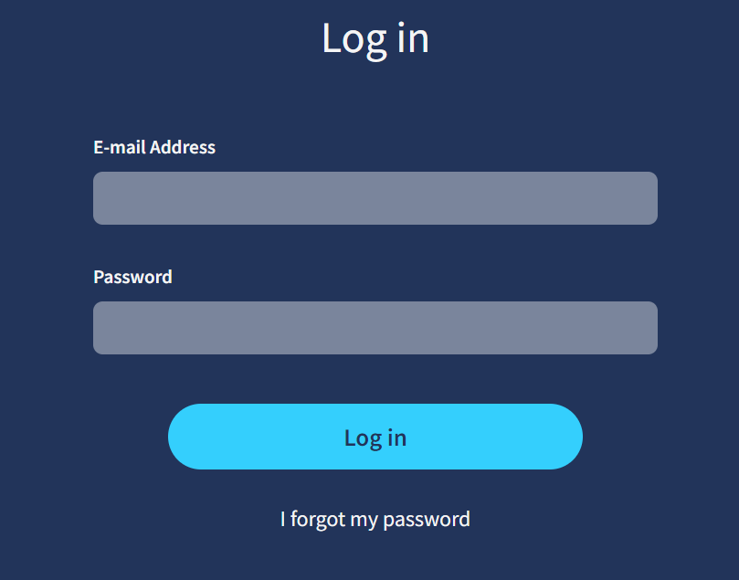
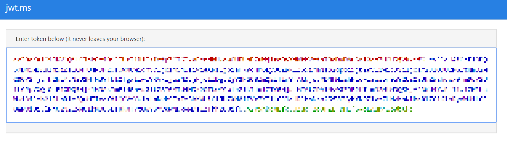

Authentication
**************

Each request of this API requires authentication. We utilizes JSON Web Token (JWT) to identify the user.

.. note::

    You can find an example of how to authenticate in our `code samples <https://github.com/tedee-com/tedee-api-doc/blob/master/samples/cs/Tedee.Api.CodeSamples/Actions/01_Authenticate_Using_JWT.cs>`_.

To authenticate you must:

#. :ref:`get-the-jwt`
#. :ref:`add-jwt-to-the-headers`

.. _get-the-jwt:

Get the access token (JWT)
==========================

There are two policies that can be used to get the JWT:

TODO put a table here and describe when to use which

- :ref:`use-portal`
- :ref:`call-auth-api`

.. warning::

    Please remember to protect the access token and store it in a secure place.
    If someone else can capture your JWT, they can pretend to be you and invoke some actions in your behalf.

.. _use-portal:

KMSI policy
------------------------

This is the easiest way and recommended for applications where interaction with user is possible. To receive the JWT using the standard login flow first go to the `login page <|authApiUrl|/oauth2/v2.0/authorize?p=B2C_1A_Signup_Signin_With_Kmsi&client_id=|clientId|&nonce=defaultNonce&redirect_uri=https%3A%2F%2Fjwt.ms&scope=openid&response_type=id_token&prompt=login>`_.

You should see the login form like below:

Provide your credentials and click **Log in** button. After that you should be redirected to the page with your access token.

This long string in the frame is your access token. You can use it now to :ref:`authenticate your calls <add-jwt-to-the-headers>` to the API.

.. _call-auth-api:

ROPC policy
-------------------------------

We recommend this approach in any kind of automations. To receive the JWT without user interaction, you must send following POST request.

**Request url:**

.. code-block::

    |authApiUrl|/oauth2/v2.0/token?p=B2C_1_SignIn_Ropc

**Request body:**

* grant_type - :code:`password`
* username - provide you user name/email
* password - provide you password
* scope - :code:`openid |clientId|`
* client_id - :code:`|clientId|`
* response_type - :code:`token id_token`

**Request headers:**

* Content-Type - :code:`application/x-www-form-urlencoded`

.. code-block:: sh
    :caption: curl

    curl -d "grant_type=password&username=[username]&password=[password]$&scope=openid |clientId|&client_id=|clientId|&response_type=token id_token" -H "Content-Type: application/x-www-form-urlencoded" -X POST |authApiUrl|/oauth2/v2.0/token?p=B2C_1_SignIn_Ropc

.. code-block:: csharp
    :caption: C#

    public async Task<string> GetAccessToken()
    {
        using (var client = new HttpClient())
        {
            var parameters = new Dictionary<string, string>
            {
                { "grant_type", "password" },
                { "username", "<<user_name>>" },
                { "password", "<<password>>" },
                { "scope", "openid |clientId|" },
                { "client_id", "|clientId|" },
                { "response_type", "token id_token" }
            };

            var authApiUrl = "|authApiUrl|/oauth2/v2.0/token?p=B2C_1_SignIn_Ropc";

            // FormUrlEncodedContent adds "application/x-www-form-urlencoded" Content-Type by default
            using (var content = new FormUrlEncodedContent(parameters))
            {
                var response = await client.PostAsync(authApiUrl, content);
                var result = await response.Content.ReadAsAsync<AccessTokenResponse>();

                return result.AccessToken;
            }
        }
    }

    public class AccessTokenResponse
    {
        [JsonProperty("access_token")]
        public string AccessToken { get; set; }
        [JsonProperty("id_token")]
        public string IdToken { get; set; }
        [JsonProperty("token_type")]
        public string TokenType { get; set; }
        [JsonProperty("expires_in")]
        public int ExpiresIn { get; set; }
    }

If all the values are correct you should get response like below:

.. code-block:: json

    {
        "access_token": "<<actual access_token>>",
        "token_type": "Bearer",
        "expires_in": "10800",
        "id_token": "<<id_token>>"
    }

The value of the :code:`access_token` property is your **JWT** that should be used to :ref:`authenticate your calls <add-jwt-to-the-headers>` to the API.

.. _add-jwt-to-the-headers:

Attach JWT to the request
============================

Now, since we have our :ref:`JWT <get-the-jwt>`, we can use it to authenticate our calls.
To achieve that, we just have to add an ``Authorization`` header containing our access token. This header value should look like ``Bearer <<access_token>>``, where **<<access_token>>** is our JWT. 

Let's see it on the below examples where we want to get information about all our devices:

.. code-block:: sh
    :caption: curl

    curl -H "Authorization: Bearer <<access_token>>" |apiUrl|/api/v1.12/my/device

.. code-block:: csharp
    :caption: C#

    public async Task GetAllDevices()
    {
        var jwt = "<<access_token>>";
        using (var client = new HttpClient())
        {
            client.DefaultRequestHeaders.Authorization = new AuthenticationHeaderValue("Bearer", jwt);

            var response = await client.GetAsync("|apiUrl|/api/v1.12/my/device");
            var devices = await response.Content.ReadAsStringAsync();

            Console.WriteLine("My devices: " + devices);
        }
    }

JWT token details
=================

<TODO describe whot the JWT token contains (focus mostly on our custom fields + link to https://jwt.io/introduction/), how to use this site https://jwt.io/ to debug it
and how long it is valid>
