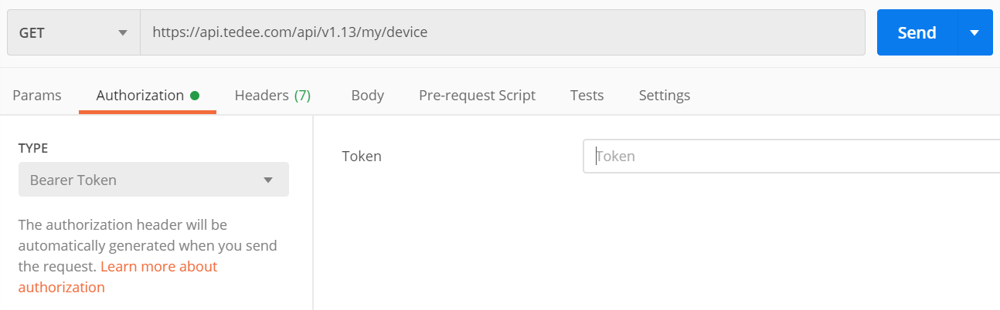

Getting started
===============

Tedee's API exposes resources that enable you to work with your devices. By calling relevant endpoint user is able, among others, to manipulate lock, get battery level or read it's activities. This guide aims to help you to get started with Tedee's API.

What you need?
--------------

Starting working with the API doesn't require much prerequisites.
You'll need:

* REST API client - `Postman <https://www.postman.com/>`_ is a great example here

Registration and authentication
-------------------------------

Before you can use the API you must create an account first. This can be done using the mobile tedee app. Every request requires authentication token. The process of authentication is described in dedicated :doc:`section <../howtos/authenticate>`, however for now we'll just need to `get JWT <howtos/authenticate.html#get-the-jwt>`_ (described in mentioned section). Once we've got our access token we can use Postman to make authenticated request.

To do this open Postman and go to Authorization tab. 

.. _`postman-screen`:

In ``TYPE`` dropdown select **Bearer Token** and in ``Token`` input field put your access token.
From now on, our requests should be authenticated.

REST API request
----------------

To interact with the Tedee REST API, you send HTTP requests that use a supported method: GET, POST, PATCH, or DELETE. POST and PATCH request bodies and server responses are sent in JSON payloads.

The path URL resource names and query parameters are case insensitive. However, values you assign, entity IDs, and other base64 encoded values are case sensitive.

Request message URI
^^^^^^^^^^^^^^^^^^^

All Tedee REST API requests use the following URL format:

``|apiUrl|/{version}/{resource}``

* **version** - we use :doc:`API versioning <api-versioning>` to deliver new functionalities more easily, keeping backwards compatibility
* **resource** - path to the resource you want to manipulate

Request message headers
^^^^^^^^^^^^^^^^^^^^^^^

Requests require additional meta data sent in headers, which help to process them correctly:

.. _`authorization-header`:

* **Authorization** - contains personal access key (PAK) or access token (JWT) to authorize the request (:doc:`read more <../howtos/authenticate>`)
* **Content-Type** - ``application/json`` value is required in this header for POST, PUT and PATCH requests

User context
^^^^^^^^^^^^

Tedee API is based on REST architecture. This implies that the application does not store any state.
Hence, the client session can not be handled on the server side and every request should provide the information about the user.
This is handled by PAK or JWT included in :ref:`authorization <authorization-header>` header. The personal access key (PAK) and access token (JWT) contain an information that allows to identify the user.
All the requests that starts with ``/my/`` referes to resources directly assigned to the current user for example asking for ``/my/devices`` will return only devices to which authenticated user has access.

Example request
^^^^^^^^^^^^^^^^

Let's get some information about our devices now.
Put this address ``|apiUrl|/api/|apiVersion|/my/device`` in the `url` input like in the :ref:`screen above <postman-screen>` and click **Send**.

.. code-block:: http

 GET |apiUrl|/api/|apiVersion|/my/device HTTP/1.1
 Accept: application/json
 Authorization: PersonalKey <<personal access key>>

You should receive response with all your devices.

REST API Response
-----------------

Response HTTP code
^^^^^^^^^^^^^^^^^^

Each response contains an HTTP code that informs about the status of the request processing. Tedee API uses standard `HTTP status codes <https://developer.mozilla.org/en-US/docs/Web/HTTP/Status>`_.

Response message body
^^^^^^^^^^^^^^^^^^^^^

Each endpoint returns data in the same format:

.. code-block:: js

  {
    "result": object,
    "success": boolean,
    "errorMessages": array,
    "statusCode": number
  }

* **result** - represents actual data that user requests for,
* **success** - describes weather the request has been processed successfully or not,
* **errorMessages** - is an array of eventual errors that occured while processing the request,
* **statusCode** - represents Http status code of the response.

Response message headers
^^^^^^^^^^^^^^^^^^^^^^^^

Here's a list of most important headers returned in Tedee API responses:

* **Content-Length** - size of the response body
* **Content-Type** - indicates the media type of the resource, ``application/json`` in most cases
* **X-Correlation-ID** - corralates subsequent requests
* **Date** - includes date and time when the messages was sent
* **API-Supported-Versions** - lists all available API versions for that endpoint

Example response
^^^^^^^^^^^^^^^^

Below is an example response for the battery level request:

* HTTP status code - ``200``
* Response body:

    .. code-block:: js

        {
            "result": {
                "level": 75,
                "date": "2020-04-01T11:31:54.969"
            },
            "success": true,
            "errorMessages": [],
            "statusCode": 200
        }

* Response headers:

    .. code-block:: yaml
    
        api-supported-versions: 1.9, 1.10, 1.11, 1.12, 1.13 
        content-encoding: gzip 
        content-length: 220 
        content-type: application/json; charset=utf-8 
        status: 200 
        x-correlation-id: 800003f6-0400-1600-d63f-84710c7967bb
        Date: Wed, 01 Apr 2020 14:17:21 GMT 

Code samples
------------

Tedee API documentation also provides `code samples <https://github.com/tedee-com/tedee-api-doc/tree/master/samples>`_ which present practical usage examples.
Currently you can find there samples written in C#.

.. note::
   Before you run any sample, provide user name and password in the **appsettings.json** file to authenticate.

What's next?
------------

Here's a list of example actions that you can do using the API:

* :doc:`Get and sync your locks <howtos/get-and-sync-locks>`
* :doc:`Operate your locks <howtos/operate-locks>`
* :doc:`Update lock settings <howtos/update-lock-settings>`

Legal notice
------------

The following legal terms (“Legal Notice”) apply to all use of Tedee’s API. By accessing or using our API, you agree to these terms in full.

**1. NO WARRANTIES; “AS-IS” BASIS**

Tedee provides its API and all related content strictly on an “as-is” and “as-available” basis. To the fullest extent permitted by applicable law, Tedee disclaims all representations and warranties of any kind, whether express, implied, statutory or otherwise - including, without limitation, warranties of title, non-infringement, merchantability, fitness for a particular purpose, uninterrupted availability, accuracy, or those arising from course of dealing or usage of trade .
 
**2. LIMITATION OF LIABILITY**

Under no circumstances shall Tedee, its affiliates, officers, directors, employees or agents be liable for any indirect, incidental, special, consequential, punitive or exemplary damages—including, without limitation, lost profits, lost revenue, loss of data or business interruption—arising out of or in connection with your use of, or inability to use, the APIs, even if Tedee has been advised of the possibility of such damages 
 
To the maximum extent permitted by law, Tedee’s total liability for any claim arising from or related to these APIs, whether in contract, tort (including negligence), strict liability or otherwise, is limited to the greater of (a) the fees you have actually paid to Tedee for use of the applicable API during the six months immediately preceding the event giving rise to liability, or (b) the re-supply of the API.
 
**3. INDEMNIFICATION**

You agree to defend, indemnify and hold harmless Tedee and its affiliates, officers, directors, employees and agents from and against any and all liabilities, damages, losses, claims, costs and expenses (including reasonable legal fees) arising out of or relating to:
Your use of, or inability to use, the API;
Your breach of this Legal Notice or any other agreement with Tedee; or
Any content, data or materials you transmit to or through the API

**4. THIRD-PARTY CONTENT & SERVICES**

The API may expose content or services owned by third parties. Tedee makes no representations or warranties whatsoever regarding the legality, accuracy, copyright compliance, or quality of any such third-party content or services. You bear all risks associated with your access to and use of third-party content through the API.
 
**5. REGULATORY COMPLIANCE**

You are solely responsible for ensuring your use of the APIs complies with all applicable laws, regulations, export controls, and third-party rights (including without limitation privacy, data protection, and intellectual property rights).
 
**6. MODIFICATIONS; TERMINATION**

Tedee may modify or discontinue, temporarily or permanently, all or part of the API at any time and without notice. You agree that Tedee will not be liable to you or any third party for any modification, suspension, or discontinuation of the API.
