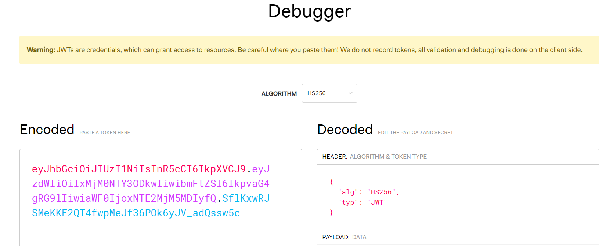
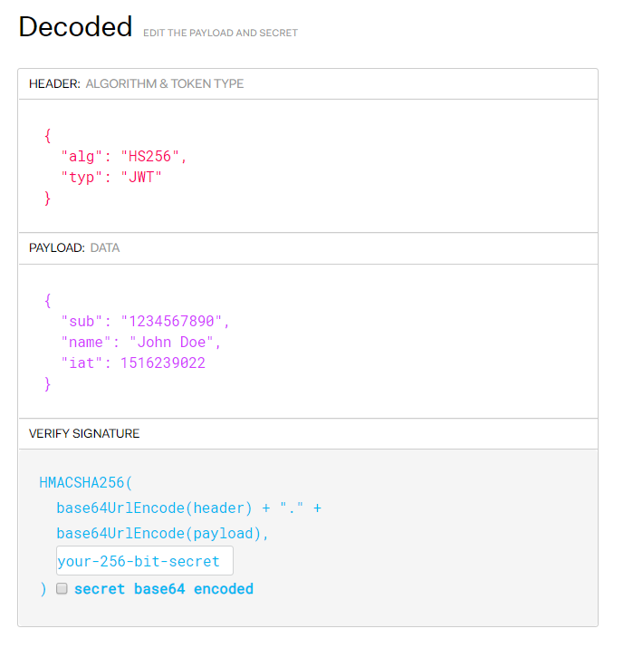

How to authenticate
===================

Each request of this API requires authentication. We utilizes OAuth 2.0 or Personal Access Key to identify the user.

+--------------------------------------------------------------------+---------------------------------------------------------------------------------------------+
| **Authentication type**                                            | **Description**                                                                             |
+--------------------------------------------------------------------+---------------------------------------------------------------------------------------------+
| :ref:`Personal Access Key <personal-access-key>`                   | User can create his own keys with different scopes and expiration dates and then            |
|                                                                    |                                                                                             |
|                                                                    | use them to authenticate his requests                                                       |
+--------------------------------------------------------------------+---------------------------------------------------------------------------------------------+
| :ref:`Oauth 2.0 <Oauth-20>`                                        | Standard OAuth 2.0 type of authentication based on tokens.                                  |
|                                                                    |                                                                                             |
|                                                                    | We support two flows Code and Implicit                                                      |
+--------------------------------------------------------------------+---------------------------------------------------------------------------------------------+

.. _personal-access-key:

Personal Access Key
--------------------------

To authenticate via personal access key (PAK) first you need to generate it on your account. 
To do this you need to send request to :doc:`Create Personal Access Key <../endpoints/personalaccesskey/create>` endpoint.

**Sample response**

.. code-block:: js

        {
            "result": {
                "id": "bcc1fdc9-13ee-43b3-a13e-eaba8eaf7996",
                "key": "smnxaz.IWA6u00VLQmA8tlfioDXcH+bSiI6u8LgTG9cv3Evh/E"
            }
            "success": true,
            "errorMessages": [],
            "statusCode": 201
        }

The PAK is in result.key.

.. warning::
    Keep your key secure!

.. note::
    You can see the full personal access key just once in the response. 

After creating a PAK you can use it to authenticate to endpoints that you gave permissions (by defining proper scopes). 
To use this type of authentication use schema PersonalKey in the Authorization header.

**Sample request to get lock using PersonalKey schema**

.. code-block:: sh

    curl -X GET "|apiUrl|/api/|apiVersion|/my/lock/1" -H "accept: application/json" -H "Authorization: PersonalKey <<personal key>>"

.. _Oauth-20:

OAuth 2.0
-----------

We support two OAuth 2.0 authorization flows to get the access token:

+--------------------------------------------------------------------+---------------------------------------------------------------------------------------------+
| **Flow name**                                                      | **When to use**                                                                             |
+--------------------------------------------------------------------+---------------------------------------------------------------------------------------------+
| :ref:`Code Flow <code-flow>`                                       | When you can store refresh tokens and periodically exchange them for access tokens.         |
|                                                                    |                                                                                             |
|                                                                    | One time interaction with the user is needed to obtain the refresh token.                   |
|                                                                    |                                                                                             |
|                                                                    | Examples: service apps                                                                      |
+--------------------------------------------------------------------+---------------------------------------------------------------------------------------------+
| :ref:`Implicit Flow <implicit-flow>`                               | When you cannot store refresh tokens.                                                       |
|                                                                    |                                                                                             |
|                                                                    | Interaction with the user is needed to obtain access tokens after they expire.              |
|                                                                    |                                                                                             |
|                                                                    | Examples: SPA, desktop apps                                                                 |
+--------------------------------------------------------------------+---------------------------------------------------------------------------------------------+

.. warning::

    Please remember to protect the access token and store it in a secure place.
    If someone else can capture your JWT, they can pretend to be you and invoke some actions in your behalf.

.. _code-flow:

Code Flow
^^^^^^^^^^^^^

.. warning::

    Code flow should not be used in public facing application (for example service apps) only service to service. 
    If you intend to use code flow with public facing application please consider using `proof key for code exchange <https://auth0.com/docs/flows/authorization-code-flow-with-proof-key-for-code-exchange-pkce>`_.

This flow should be used for applications that can store refresh tokens and periodically exchange them for access tokens after they expire.
One time interaction with the user is needed to obtain the refresh token. Next, the refresh token can be used to automatically obtain the next refresh tokens and access tokens.
Access token is valid for 4 hours. Refresh token is valid for 14 days.

.. note::
    To receive the JWT using Code Flow you will need a **client id** and **client secret** issued for your application by Tedee.
    You can find a guide to achieve that on `How to begin integration <begin-integration.html#get-client-id>`_ page.

There are three steps to get the JWT using Code Flow:

**1) Get an authorization code**

The authorization process begins with the GET request to the authorization endpoint. This is the interactive part of the flow, where the user takes action.

.. code-block:: sh

    GET |authApiUrl|/B2C_1A_Signup_Signin_With_Kmsi/oauth2/v2.0/authorize
    ?response_type=code
    &client_id={client_id}
    &redirect_uri={redirect_uri}
    &response_mode={response_mode}
    &scope={scope}
    &state={state}

* **client_id** - The client id assigned to your application.
* **redirect_uri** - The redirect URI of your application, where authentication responses are sent and received by your application.
* **response_mode** - The method that you use to send the resulting authorization code back to your application. It can be **query**, **form_post**, or **fragment**. You need to choose the one that is compatible with your application.
* **scope** - A space-separated list of scopes. A single scope value indicates the permissions that are being requested. The **offline_access** scope indicates that your app needs a refresh token for long-lived access to resources. The "|scopePrefix|user_impersonation" scope is required (:ref:`list of available scopes <list-of-scopes>`).
* **state** - A value included in the request that can be a string of any content that you want to use. Usually, a randomly generated unique value is used, to prevent cross-site request forgery attacks.

**Example**

.. code-block:: sh

    GET |authApiUrl|/B2C_1A_Signup_Signin_With_Kmsi/oauth2/v2.0/authorize
    ?response_type=code
    &client_id=bcc1fdc9-13ee-43b3-a13e-eaba8eaf7996
    &redirect_uri=https://yoursite.com/auth
    &response_mode=query
    &scope=https://tedee.onmicrosoft.com/api/user_impersonation%20https://tedee.onmicrosoft.com/api/Lock.Operate  
    &state=d917d40e-0b1a-4495-8e23-e449c916a532

After the user sign-in, the authorization code will be sent to your application to the address specified in the **redirect_uri** parameter (using the method specified in the **response_mode** parameter).

A successful response that uses response_mode=query looks like this:

.. code-block:: sh

    GET {redirect_uri}
    ?code={code}
    &state={state}

* **redirect_uri** - The redirect URI of your application.
* **code** - The authorization code that the application requested.
* **state** - If a state parameter is included in the request, the same value should appear in the response. The application should verify that the state values in the request and response are identical.

**2) Get a token**

After successfully receiving the authorization code, you can use it to request an access token by sending a POST request to the token endpoint.

.. code-block:: sh

    POST |authApiUrl|/B2C_1A_Signup_Signin_With_Kmsi/oauth2/v2.0/token
    Content-Type: application/x-www-form-urlencoded

    grant_type=authorization_code
    &client_id={client_id}
    &client_secret={client_secret}
    &scope={scope}
    &code={code}
    &redirect_uri={redirect_uri}

* **client_id** - The client id assigned to your application.
* **client_secret** - The application client secret.
* **scope** - A space-separated list of scopes. A single scope value indicates the permissions that are being requested. The **offline_access** scope indicates that your app needs a refresh token for long-lived access to resources. The "|scopePrefix|user_impersonation" scope is required (:ref:`list of available scopes <list-of-scopes>`).
* **code** - The authorization code that you acquired in the first step of the flow.
* **redirect_uri** - The redirect URI of the application where you received the authorization code.

**Example**

.. code-block:: sh

    POST |authApiUrl|/B2C_1A_Signup_Signin_With_Kmsi/oauth2/v2.0/token
    Content-Type: application/x-www-form-urlencoded

    grant_type=authorization_code
    &client_id=bcc1fdc9-13ee-43b3-a13e-eaba8eaf7996
    &client_secret=81A2Bde1ZsZeEPDJLASKq1sBsuKaNa11W+3biasTkLAC=
    &scope=https://tedee.onmicrosoft.com/api/user_impersonation%20https://tedee.onmicrosoft.com/api/Lock.Operate  
    &code=AwABAAAAvPM1KaPlrEqdFSBzjqfTGBCmLdgfSTLEMPGYuNHSUYBrq
    &redirect_uri=https://yoursite.com/auth

A successful token response looks like this:

.. code-block:: json

    {
        "not_before": "1442340812",
        "token_type": "Bearer",
        "access_token": "eyJ0eXAiOiJKV1QiLCJhbGciOiJSUzI1NiIsIng1dCI6Ik5HVEZ2ZEstZnl0aEV1Q...",
        "expires_in": "3600",
        "refresh_token": "AwABAAAAvPM1KaPlrEqdFSBzjqfTGAMxZGUTdM0t4B4...",
        "refresh_token_expires_in": 1209600
    }

* **not_before** - The time at which the token is considered valid, in epoch time.
* **token_type** - The token type value (Bearer).
* **access_token** - The signed JSON Web Token (JWT) that you requested.
* **expires_in** - The length of time that the access token is valid (in seconds).
* **refresh_token** - An OAuth 2.0 refresh token. The app can use this token to acquire additional tokens after the current token expires.
* **refresh_token_expires_in** - The length of time that the refresh token is valid (in seconds).

The value of the :code:`access_token` property is your **JWT** that should be used to :ref:`authenticate your calls <add-jwt-to-the-headers>` to the API.

**3) Refresh the token**

Access tokens are short-lived. After they expire, you must refresh them to continue to access resources. To do this, submit another POST request to the token endpoint. This time, set **grant_type=refresh_token** and provide the refresh token instead of the authorization code.

.. code-block:: sh

    POST |authApiUrl|/B2C_1A_Signup_Signin_With_Kmsi/oauth2/v2.0/token
    Content-Type: application/x-www-form-urlencoded

    grant_type=refresh_token
    &client_id={client_id}
    &client_secret={client_secret}
    &scope={scope}
    &refresh_token={refresh_token}
    &redirect_uri={redirect_uri}

.. _implicit-flow:

Implicit Flow
^^^^^^^^^^^^^^

This flow should be used for applications that cannot store refresh tokens. 
In this case, interaction with the user is needed to obtain access tokens after they expire.
Access token is valid for 4 hours.

.. note::
    To receive the JWT using Implicit Flow you will need a **client id** issued for your application by Tedee.
    You can find a guide to achieve that on `How to begin integration <begin-integration.html#get-client-id>`_ page.

The authorization process begins with the GET request to the authorization endpoint. This is the interactive part of the flow, where the user takes action.

.. code-block:: sh

    GET |authApiUrl|/B2C_1A_Signup_Signin_With_Kmsi/oauth2/v2.0/authorize
    ?response_type=token
    &client_id={client_id}
    &redirect_uri={redirect_uri}
    &response_mode=fragment
    &scope={scope}
    &state={state}
    &nonce={nonce}

* **client_id** - The client id assigned to your application.
* **redirect_uri** - The redirect URI of your application, where authentication responses are sent and received by your application.
* **scope** - A space-separated list of scopes. A single scope value indicates the permissions that are being requested. The "|scopePrefix|user_impersonation" scope is required (:ref:`list of available scopes <list-of-scopes>`).
* **state** - A value included in the request that also is returned in the token response. It can be a string of any content that you want to use. Usually, a randomly generated unique value is used, to prevent cross-site request forgery attacks.
* **nonce** - A value included in the request (generated by the app) that is included in the resulting token as a claim. The app can then verify this value to mitigate token replay attacks. Usually, the value is a randomized, unique string that can be used to identify the origin of the request.

**Example**

.. code-block:: sh

    GET |authApiUrl|/B2C_1A_Signup_Signin_With_Kmsi/oauth2/v2.0/authorize
    ?response_type=token
    &client_id=bcc1fdc9-13ee-43b3-a13e-eaba8eaf7996
    &redirect_uri=https://yoursite.com/auth
    &response_mode=fragment
    &scope=https://tedee.onmicrosoft.com/api/user_impersonation%20https://tedee.onmicrosoft.com/api/Lock.Operate  
    &state=d917d40e-0b1a-4495-8e23-e449c916a532
    &nonce=defaultNonce

After the user sign-in, a response will be sent to your application to the address specified in the **redirect_uri** parameter.

A successful response looks like this:

.. code-block:: sh

    GET {redirect_uri}/#
    access_token={access_token}
    &token_type=Bearer
    &expires_in=3600
    &state={state}

* **access_token** - The signed JSON Web Token (JWT) that you requested.
* **token_type** - The token type value (Bearer).
* **expires_in** - The length of time that the token is valid (in seconds).
* **state** - If a state parameter is included in the request, the same value should appear in the response. The application should verify that the state values in the request and response are identical.

The value of the :code:`access_token` property is your **JWT** that should be used to :ref:`authenticate your calls <add-jwt-to-the-headers>` to the API.
Implicit Flow does not issue refresh tokens. Interaction with the user is required to obtain a new access token after the current one has expired.

.. _add-jwt-to-the-headers:

Attach JWT to the request
--------------------------

Now, since we have our JWT, we can use it to authenticate our calls.
To achieve that, we just have to add an ``Authorization`` header containing our access token. This header value should look like ``Bearer <<access_token>>``, where **<<access_token>>** is our JWT. 

Let's see it on the below examples where we want to get information about all our devices:

.. code-block:: sh

    curl -H "Authorization: Bearer <<access_token>>" |apiUrl|/api/|apiVersion|/my/device

JWT token details
-----------------

`JSON Web Token (JWT) <https://jwt.io/introduction/>`_ is open standard of securely transmitting information between parties. Anyone who has access to the token is able to decode it and read the information.

Claims
^^^^^^^

The JWT contains useful information which you can use and the table below describe the most important one:

+------------------+--------------------------------------------------------------------------------+
| **Claim name**   | **Description**                                                                |
+------------------+--------------------------------------------------------------------------------+
| exp              | Presents the expiration time on and after which the JWT will not be processed. |
+------------------+--------------------------------------------------------------------------------+
| email            | Contains user's email address provided during registration process.            |
+------------------+--------------------------------------------------------------------------------+
| name             | Contains user's name provided during registration process.                     |
+------------------+--------------------------------------------------------------------------------+
| oid              | User's unique identifier assigned during registration process.                 |
+------------------+--------------------------------------------------------------------------------+

You can read more about claims `here <https://tools.ietf.org/html/rfc7519#section-4.1>`_.

Expiration date
^^^^^^^^^^^^^^^^^

Tedee API tokens are valid for 4 hours since the creation time.

Debugger
^^^^^^^^^^

`https://jwt.io <https://jwt.io>`_ provides a very usefull online tool to work with JWT tokens. You can use it to decode and read data included in JWT. To do that go to `JWT debugger <https://jwt.io/#debugger-io>`_
and fill in the **Encoded** input field with your token.

You should see the decoded data right away on the right side of the screen

.. _list-of-scopes:

Scopes
------

Scopes define the set of permissions that the application requests.
Below is a list of available scopes that can be requested during the authorization process (a single scope value indicates the permissions that are being requested).

+----------------------------------------------------------------------------+-----------------------------+-------------------------------------------------------------------------------------------------------------------------------------------------------------------------------------------------+
| Scope                                                                      | Operation                   | Description                                                                                                                                                                                     |
+============================================================================+=============================+=================================================================================================================================================================================================+
| https://tedee.onmicrosoft.com/api/user_impersonation                       | Impersonate user            | Access this app on behalf of the signed-in user.                                                                                                                                                |
+----------------------------------------------------------------------------+-----------------------------+-------------------------------------------------------------------------------------------------------------------------------------------------------------------------------------------------+
| https://tedee.onmicrosoft.com/api/Account.Read                             | View user account           | Grants the ability to view user information.                                                                                                                                                    |
+----------------------------------------------------------------------------+-----------------------------+-------------------------------------------------------------------------------------------------------------------------------------------------------------------------------------------------+
| https://tedee.onmicrosoft.com/api/Account.ReadWrite                        | View and edit user account  | Grants the ability to view and edit user information. Also grant the ability to delete user account.                                                                                            |
+----------------------------------------------------------------------------+-----------------------------+-------------------------------------------------------------------------------------------------------------------------------------------------------------------------------------------------+
| https://tedee.onmicrosoft.com/api/Device.Read                              | View devices                | Grants the ability to view all devices and query information for specific device.                                                                                                               |
+----------------------------------------------------------------------------+-----------------------------+-------------------------------------------------------------------------------------------------------------------------------------------------------------------------------------------------+
| https://tedee.onmicrosoft.com/api/Device.ReadWrite                         | View and edit devices       | Grants the ability to view all devices and query information for specific device. Also grants the ability to add and delete devices, and update device settings or current status of the device.|
+----------------------------------------------------------------------------+-----------------------------+-------------------------------------------------------------------------------------------------------------------------------------------------------------------------------------------------+
| https://tedee.onmicrosoft.com/api/DeviceShare.Read                         | View device shares          | Grants the ability to view shares for all devices or for specific device.                                                                                                                       |
+----------------------------------------------------------------------------+-----------------------------+-------------------------------------------------------------------------------------------------------------------------------------------------------------------------------------------------+
| https://tedee.onmicrosoft.com/api/DeviceShare.ReadWrite                    | View and edit device shares | Grants the ability to view shares for all devices or for specific device. Also grants the ability to update or delete existing share or create new one.                                         |
+----------------------------------------------------------------------------+-----------------------------+-------------------------------------------------------------------------------------------------------------------------------------------------------------------------------------------------+
| https://tedee.onmicrosoft.com/api/DeviceActivity.Read                      | View activity logs          | Grants the ability to query activity logs.                                                                                                                                                      |
+----------------------------------------------------------------------------+-----------------------------+-------------------------------------------------------------------------------------------------------------------------------------------------------------------------------------------------+
| https://tedee.onmicrosoft.com/api/Bridge.Operate                           | Operate bridges             | Grants the ability to pair and unpair locks with bridges.                                                                                                                                       |
+----------------------------------------------------------------------------+-----------------------------+-------------------------------------------------------------------------------------------------------------------------------------------------------------------------------------------------+
| https://tedee.onmicrosoft.com/api/Lock.Operate                             | Operate locks               | Grants the ability to lock, unlock and perform pull spring. Also grants the ability to perform lock calibration.                                                                                |
+----------------------------------------------------------------------------+-----------------------------+-------------------------------------------------------------------------------------------------------------------------------------------------------------------------------------------------+