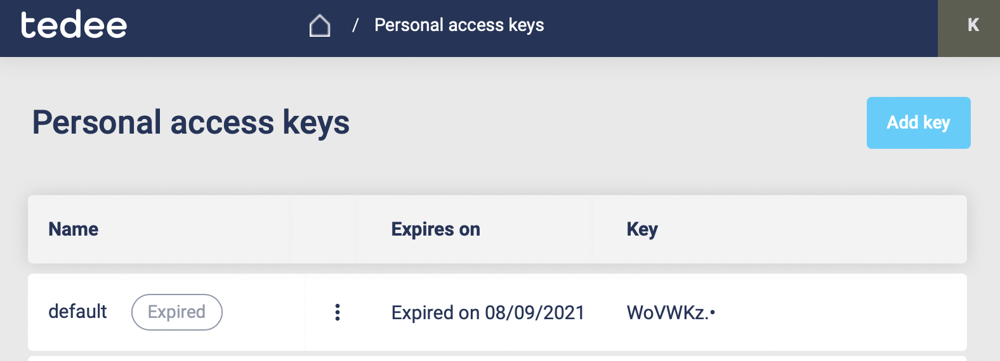

How to authenticate
===================

Each request of this API requires authentication. We utilizes OAuth 2.0 or Personal Access Key to identify the user.

+--------------------------------------------------+--------------------------------------------------------------------------------+
| **Authentication type**                          | **Description**                                                                |
+--------------------------------------------------+--------------------------------------------------------------------------------+
| :ref:`Personal Access Key <personal-access-key>` | Simplest one. Generate key for your account and use it in each request.        |
|                                                  |                                                                                |
|                                                  | Use it to write your private integration or automation.                        |
|                                                  |                                                                                |
|                                                  | Does not requires user interaction.                                            |
+--------------------------------------------------+--------------------------------------------------------------------------------+
| :ref:`OAuth 2.0 <Oauth-20>`                      | Standard OAuth 2.0 type of authentication based on JWT tokens.                 |
|                                                  |                                                                                |
|                                                  | Usually used by our partners to connect both services.                         |
|                                                  |                                                                                |
|                                                  | Use it when you build public service or app which will be used by other users. |
+--------------------------------------------------+--------------------------------------------------------------------------------+

.. _personal-access-key:

Personal Access Key (PAK)
-------------------------

Best way to start writing integration. To authenticate via personal access key (PAK) first you need to generate it on your account. 
To do this you can use `Tedee Portal <https://portal.tedee.com>`_.

.. warning::
    Treat the PAK as your password, keep it in a safe place and don't share it with anyone. Anyone who knows it can use it to gain access to your locks.

Generate PAK using Tedee Portal
^^^^^^^^^^^^^^^^^^^^^^^^^^^^^^^

Open the `Tedee Portal - Personal Access Keys <https://portal.tedee.com/personal-access-keys>`_ page. Here you see the list of personal access keys created by you.
You can navigate to this page by clicking in the top right corner, on your initials and selecting the `Personal Access Keys` in the user menu.
You can edit, delete or add new keys from here.

If you want to add a new personal access key, click `Add key` located in the top right corner of the screen. After clicking the button sidebar on the right screen should appear.

|

Type the personal access key name, choose the expiration date and select the access scopes required by your integration.

| 

The personal key is created. Remember to save your key. You can copy the key by clicking the copy button located on the right side of the `My new key` textbox.

.. _add-pak-to-the-headers:

Attach PAK to the request
^^^^^^^^^^^^^^^^^^^^^^^^^

Now, since we have our PAK, we can use it to authenticate our calls.
To achieve that, we just have to add an ``Authorization`` header containing our personal access key (PAK). This header has to be in the following format ``PersonalKey <<personal access key>>``, where **PersonalKey** is the authorization scheme, and **<<personal access key>>** must be replaced with your unique personal access key (PAK).

Let's see it on the below example where we want to get information about all our devices:

.. code-block:: sh

    curl -X GET "|apiUrl|/api/|apiVersion|/my/device" -H "Authorization: PersonalKey <<personal access key>>" -H "accept: application/json"

.. _Oauth-20:

OAuth 2.0
-----------

Usually used by our partners to integrate services together. We support following OAuth 2.0 authorization flows to get the access token.

+-------------------------------------+---------------------------------------------------------------------------+
| **Flow name**                       | **When to use**                                                           |
+-------------------------------------+---------------------------------------------------------------------------+
| :ref:`Code Flow + PKCE <code-flow>` | Recommended flow for any type of public integration.                      |
|                                     |                                                                           |
| with optional Secret                | One time interaction with the user is needed to obtain the refresh token. |
|                                     |                                                                           |
| **(recommended)**                   |                                                                           |
+-------------------------------------+---------------------------------------------------------------------------+
| Code Flow + Secret                  | Should be used only for service to service integration.                   |
|                                     |                                                                           |
|                                     | Cannot be used in mobile, web or desktop app.                             |
|                                     |                                                                           |
|                                     | Legacy in OAuth 2.1                                                       |
+-------------------------------------+---------------------------------------------------------------------------+

.. note::

    To use OAuth, you will need a **client id** issued for your application by Tedee. Please send the request to register your app using this `form <https://forms.office.com/Pages/ResponsePage.aspx?id=ibO271oOn0SweG6SXqsY5mzyA4EPEdlFuUag8sIe36JUNUU4VExYVksxTlU5WDRKUFNHTFdZT0Q3Ni4u>`_.
    
    In about 2 weeks, your app will be registered and we will send you the client id (and client secret if needed).

.. _code-flow:

Code Flow + PKCE
^^^^^^^^^^^^^^^^

Your app or service will request first for authorization code where user interaction is required. Then your app or service will use this code in 
second request to obtain the access token with refresh token. Access token allows your app to call API in behalf of the user but it expire after 4 hours.
Use the refresh token to periodically exchange it for new access tokens. Refresh token is valid for 14 days.  
For more details read the `Microsoft documentation <https://docs.microsoft.com/en-us/azure/active-directory-b2c/authorization-code-flow>`_.

Example below, describes how to use the Code Flow + PKCE + Secret. Do not implement it by self, instead use existing libraries like:
 - `MSAL for Android <https://github.com/AzureAD/microsoft-authentication-library-for-android>`_
 - `MSAL for iOS <https://github.com/AzureAD/microsoft-authentication-library-for-objc>`_
 - `MSAL for Python <https://github.com/AzureAD/microsoft-authentication-library-for-python>`_
 - `MSAL for JavaScript <https://github.com/AzureAD/microsoft-authentication-library-for-js>`_

.. warning::

    The **Secret** should be used only in service to service integrations. For public facing apps like Mobile or Web use just 
    Code flow with PKCE. The Secret must be kept in a secure location and accessible only to the integration developers (do not share it with end users).
    

**1) Get an authorization code**

The authorization process begins with the GET request to the authorization endpoint. This is the interactive part of the flow, where the user takes action.

.. code-block:: sh

    GET |authApiUrl|/B2C_1A_Signup_Signin_With_Kmsi/oauth2/v2.0/authorize
    ?response_type=code
    &client_id={client_id}
    &redirect_uri={redirect_uri}
    &scope={scope}
    &state={state}
    &code_challenge={code_challenge}
    &code_challenge_method={code_challenge_method}

* **client_id** - The client id assigned to your application.
* **redirect_uri** - The redirect URI of your application, where authentication responses are sent and received by your application.
* **scope** - A space-separated list of scopes. A single scope value indicates the permissions that are being requested. The |scopePrefix|user_impersonation scope is required (:ref:`list of available scopes <list-of-scopes>`). When building app with Mobile/Desktop flow, remember to add ``offline_access`` scope, which will enable obtaining ``refresh_token``.
* **state** - A randomly generated unique value is used, to prevent cross-site request forgery attacks.
* **code_challenge** - Used to secure authorization code grants via Proof Key for Code Exchange (PKCE). For details check the `PKCE RFC <https://datatracker.ietf.org/doc/html/rfc7636>`_.
* **code_challenge_method** - Can be `s256` (recommended) or `plain` (`PKCE RFC <https://datatracker.ietf.org/doc/html/rfc7636>`_). When using `s256` remember to use 43 long ``code_verifier``.

**Example**

.. code-block:: sh

    GET |authApiUrl|/B2C_1A_Signup_Signin_With_Kmsi/oauth2/v2.0/authorize
    ?response_type=code
    &client_id=bcc1fdc9-13ee-43b3-a13e-eaba8eaf7996
    &redirect_uri=https://yoursite.com/auth
    &scope=https://tedee.onmicrosoft.com/api/user_impersonation%20https://tedee.onmicrosoft.com/api/Lock.Operate%20offline_access
    &state=d917d40e-0b1a-4495-8e23-e449c916a532
    &code_challenge=long-random-pkce-challenge-value-for-plain-method
    &code_challenge_method=plain

After the user sign-in, the authorization code will be sent to your application to the address specified in the **redirect_uri** parameter.

Example response:

.. code-block:: sh

    GET {redirect_uri}
    ?code={code}
    &state={state}

* **redirect_uri** - The redirect URI of your application.
* **code** - The authorization code that the application requested.
* **state** - If a state parameter is included in the request, the same value should appear in the response. The application should verify that the state values in the request and response are identical.

**2) Get a token**

After successfully receiving the authorization code, you can use it to request an access token by sending a POST request to the token endpoint.

.. code-block:: sh

    POST |authApiUrl|/B2C_1A_Signup_Signin_With_Kmsi/oauth2/v2.0/token
    Content-Type: application/x-www-form-urlencoded

    grant_type=authorization_code
    &client_id={client_id}
    &client_secret={client_secret}
    &code={code}
    &code_verifier={code_challenge}
    &redirect_uri={redirect_uri}

* **client_id** - The client id assigned to your application.
* **client_secret** - The application client secret.
* **code** - The authorization code that you acquired in the first step of the flow.
* **code_verifier** - For `plain` method use the same value as for ``code_challenge`` (`PKCE RFC <https://datatracker.ietf.org/doc/html/rfc7636>`_).
* **redirect_uri** - The redirect URI of the application where you received the authorization code.

.. warning::

    Please remember to protect the access token and store it in a secure place.
    If someone else can capture it, they can pretend to be you and invoke some actions in your behalf.

**Example**

.. code-block:: sh

    POST |authApiUrl|/B2C_1A_Signup_Signin_With_Kmsi/oauth2/v2.0/token
    Content-Type: application/x-www-form-urlencoded

    grant_type=authorization_code
    &client_id=bcc1fdc9-13ee-43b3-a13e-eaba8eaf7996
    &client_secret=81A2Bde1ZsZeEPDJLASKq1sBsuKaNa11W+3biasTkLAC=
    &code=AwABAAAAvPM1KaPlrEqdFSBzjqfTGBCmLdgfSTLEMPGYuNHSUYBrq
    &code_verifier=long-random-pkce-challenge-value-for-plain-method
    &redirect_uri=https://yoursite.com/auth

A successful token response looks like this:

.. code-block:: json

    {
        "not_before": "1442340812",
        "token_type": "Bearer",
        "access_token": "eyJ0eXAiOiJKV1QiLCJhbGciOiJSUzI1NiIsIng1dCI6Ik5HVEZ2ZEstZnl0aEV1Q...",
        "expires_in": "3600",
        "refresh_token": "AwABAAAAvPM1KaPlrEqdFSBzjqfTGAMxZGUTdM0t4B4...",
        "refresh_token_expires_in": 1209600
    }

* **not_before** - The time at which the token is considered valid, in epoch time.
* **token_type** - The token type value (Bearer).
* **access_token** - The signed JSON Web Token (JWT) that you requested.
* **expires_in** - The length of time that the access token is valid (in seconds).
* **refresh_token** - An OAuth 2.0 refresh token. The app can use this token to acquire additional tokens after the current token expires.
* **refresh_token_expires_in** - The length of time that the refresh token is valid (in seconds).

The value of the :code:`access_token` property is your **JWT** that should be used to :ref:`authenticate your calls <add-jwt-to-the-headers>` to the API.

**3) Refresh the token**

Access tokens are short-lived. After they expire, you must refresh them to continue to access resources. To do this, submit another POST request to the token endpoint. This time, set **grant_type=refresh_token** and provide the refresh token instead of the authorization code.

.. code-block:: sh

    POST |authApiUrl|/B2C_1A_Signup_Signin_With_Kmsi/oauth2/v2.0/token
    Content-Type: application/x-www-form-urlencoded

    grant_type=refresh_token
    &client_id={client_id}
    &client_secret={client_secret}
    &scope={scope}
    &refresh_token={refresh_token}
    &redirect_uri={redirect_uri}

.. _add-jwt-to-the-headers:

Attach JWT to the request
^^^^^^^^^^^^^^^^^^^^^^^^^

Now, since we have our JWT, we can use it to authenticate our calls.
To achieve that, we just have to add an ``Authorization`` header containing our access token. This header has to be in the following format ``Bearer <<access_token>>``, where **Bearer** is the authorization scheme, and  **<<access_token>>** is our JWT. 

Let's see it on the below example where we want to get information about all our devices:

.. code-block:: sh

    curl -X GET "|apiUrl|/api/|apiVersion|/my/device" -H "Authorization: Bearer <<access_token>>" -H "accept: application/json"

JWT token details
^^^^^^^^^^^^^^^^^

`JSON Web Token (JWT) <https://jwt.io/introduction/>`_ is open standard of securely transmitting information between parties. Anyone who has access to the token is able to decode it and read the information.

Claims
~~~~~~

The JWT contains useful information which you can use and the table below describe the most important one:

+----------------+--------------------------------------------------------------------------------+
| **Claim name** | **Description**                                                                |
+----------------+--------------------------------------------------------------------------------+
| exp            | Presents the expiration time on and after which the JWT will not be processed. |
+----------------+--------------------------------------------------------------------------------+
| email          | Contains user's email address provided during registration process.            |
+----------------+--------------------------------------------------------------------------------+
| name           | Contains user's name provided during registration process.                     |
+----------------+--------------------------------------------------------------------------------+
| oid            | User's unique identifier assigned during registration process.                 |
+----------------+--------------------------------------------------------------------------------+

You can read more about claims `here <https://tools.ietf.org/html/rfc7519#section-4.1>`_.

Expiration date
~~~~~~~~~~~~~~~~~~

Tedee API access token is valid for 4 hours since the creation time.

Debugger
~~~~~~~~~~~~

`https://jwt.io <https://jwt.io>`_ provides a very useful online tool to work with JWT tokens. You can use it to decode and read data included in JWT. To do that go to `JWT debugger <https://jwt.io/#debugger-io>`_
and fill in the **Encoded** input field with your token. You should see the decoded data right away on the right side of the screen.

.. _list-of-scopes:

Scopes
------

Scopes define the set of permissions that the application requests.
Below is a list of available scopes that can be requested during the authorization process (a single scope value indicates the permissions that are being requested).

+---------------------------+---------------------------------------------------------------------------------------------------------------------------------------------------------------------------+
| Scope name                | Grants to                                                                                                                                                                 |
+===========================+===========================================================================================================================================================================+
| user_impersonation        | Access this app on behalf of the signed-in user (OAuth only)                                                                                                              |
+---------------------------+---------------------------------------------------------------------------------------------------------------------------------------------------------------------------+
| offline_access            | Required when requesting for refresh token using authorization code flow                                                                                                  |
+---------------------------+---------------------------------------------------------------------------------------------------------------------------------------------------------------------------+
| Account.Read              | View user information                                                                                                                                                     |
+---------------------------+---------------------------------------------------------------------------------------------------------------------------------------------------------------------------+
| Account.ReadWrite         | View and edit user information. Also grant the ability to delete user account                                                                                             |
+---------------------------+---------------------------------------------------------------------------------------------------------------------------------------------------------------------------+
| Bridge.Operate            | Pair and unpair devices with bridges                                                                                                                                      |
+---------------------------+---------------------------------------------------------------------------------------------------------------------------------------------------------------------------+
| Device.Read               | View all devices and query information for specific device                                                                                                                |
+---------------------------+---------------------------------------------------------------------------------------------------------------------------------------------------------------------------+
| Device.ReadWrite          | View all devices and query information for specific device. Also grants the ability to add and delete devices, and update device settings or current status of the device |
+---------------------------+---------------------------------------------------------------------------------------------------------------------------------------------------------------------------+
| DeviceActivity.Read       | Query activity logs                                                                                                                                                       |
+---------------------------+---------------------------------------------------------------------------------------------------------------------------------------------------------------------------+
| DeviceCertificate.Operate | Access devices certificates                                                                                                                                               |
+---------------------------+---------------------------------------------------------------------------------------------------------------------------------------------------------------------------+
| DeviceShare.Read          | View accesses for all devices or for specific device                                                                                                                      |
+---------------------------+---------------------------------------------------------------------------------------------------------------------------------------------------------------------------+
| DeviceShare.ReadWrite     | View accesses for all devices or for specific device. Also grants the ability to update or delete existing access or create new one                                       |
+---------------------------+---------------------------------------------------------------------------------------------------------------------------------------------------------------------------+
| Lock.Operate              | Perform lock, unlock and pull spring operations on lock                                                                                                                   |
+---------------------------+---------------------------------------------------------------------------------------------------------------------------------------------------------------------------+
| Mobile.Read               | View user registered mobiles                                                                                                                                              |
+---------------------------+---------------------------------------------------------------------------------------------------------------------------------------------------------------------------+
| Mobile.ReadWrite          | Manage user mobile or other devices                                                                                                                                       |
+---------------------------+---------------------------------------------------------------------------------------------------------------------------------------------------------------------------+
| Organization.Read         | View organization data                                                                                                                                                    |
+---------------------------+---------------------------------------------------------------------------------------------------------------------------------------------------------------------------+
| Organization.ReadWrite    | View and manage organization. Also grants the ability to add, update and delete organization devices and organization users                                               |
+---------------------------+---------------------------------------------------------------------------------------------------------------------------------------------------------------------------+
| AccessLink.Read           | Grants user possibility to view organization access links.                                                                                                                |
+---------------------------+---------------------------------------------------------------------------------------------------------------------------------------------------------------------------+
| AccessLink.ReadWrite      | Grants user possibility to manage organization access links.                                                                                                              |
+---------------------------+---------------------------------------------------------------------------------------------------------------------------------------------------------------------------+

.. note::

    To request scope in OAuth the name must be used together with resource name. To request for ``Account.Read`` scope, you must use the ``https://tedee.onmicrosoft.com/api/Account.Read`` name.