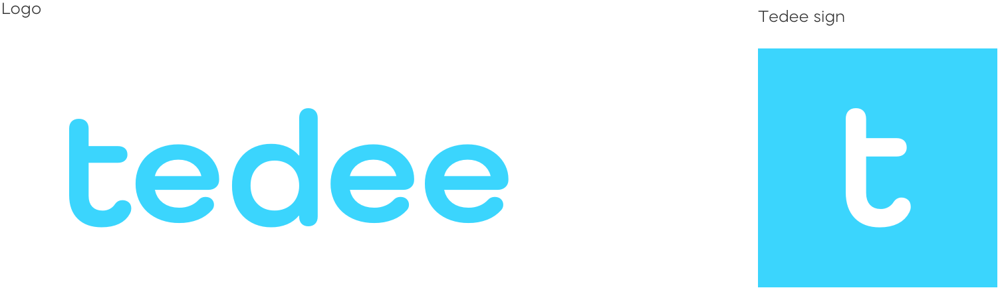
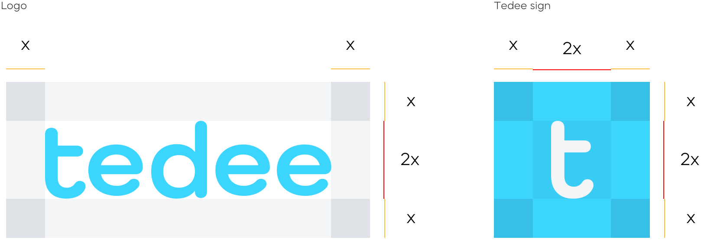
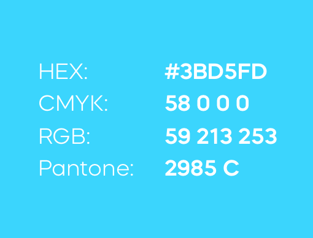
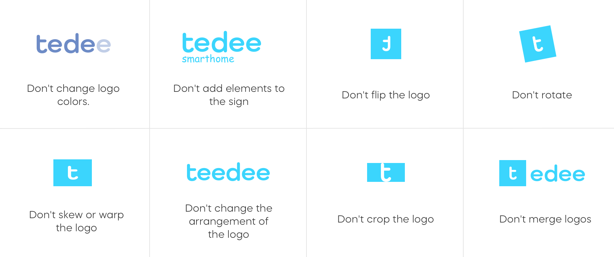
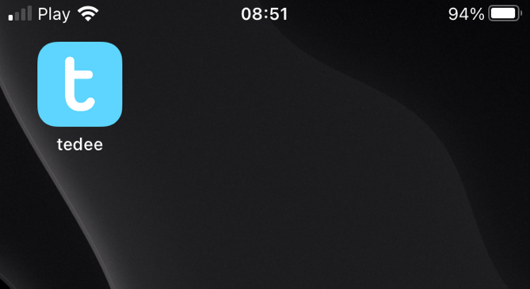

How to begin integration
========================

All the endpoints exposed on this API require authentication.
You can find a guide to achieve that on :doc:`../howtos/authenticate` page.

.. _get-client-id:

Client id for you application
-----------------------------

If you want to use Code Flow or Implicit Flow in the authorization process, you will need a **client id** issued for your application by Tedee.
Please contact us (support@tedee.com) to receive a **client id** and **client secret** for your application. 
Please provide the following information in your message:

* name of your company / application
* general description of your application
* scenarios in which your application will be used
* operations that will be performed in the Tedee API by your application
* scopes that will be requested by your application during the authorization process (`list of available scopes <../authentication.html#list-of-scopes>`_)
* which authorization flow you want to use in your application
* the redirect URI of your application, where authentication responses are sent and received by your application 
* e-mail address of the person responsible for integration

Based on above information, we will register your application in our system and send you **client id** and **client secret**.

.. _logo-guideliness:

Logo guideliness
----------------

If you want to use the tedee logo in your applicaton / plugin / extension, it must meet some requirements.

Logo variations
^^^^^^^^^^^^^^^

You can use tedee logo in two different variations: full logo - contain sign with full tedee symbol, second option is only a 't' symbol on blue background.

| `Download tedee full logo <https://storage.googleapis.com/tedee-wp/2020/11/FullTedeeLogo.zip>`_
| `Download tedee sign <https://storage.googleapis.com/tedee-wp/2020/11/TedeeSign.zip>`_

Safe areas
^^^^^^^^^^

The protective field defines the minimal area around the logo, where no other text or graphic may appear. The protective field is based on the height of the sign.

Main colour
^^^^^^^^^^^

The main brand colour is shade of blue.

List of don'ts
^^^^^^^^^^^^^^

Do not modify the logos in any way, other than resizing. If you need to resize, preserve the ratio, and ensure the badge is legible and fully visible.

Naming 
^^^^^^

You can only use 'tedee' word, as a name. Do not attempt to add some words to it, like 'tedee smarthome', 'tedee-lock'. For example, find out screen with tedee application for iOS. 

