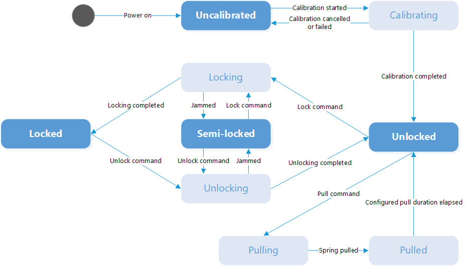

How to operate your locks
=========================

In this section let's focus on how to operate tedee locks. 
To operate lock via API you need to be owner of the device or have active share with remoteAccessDisabled flag set on false (see :doc:`Share Details <../datastructures/share-details>`). 
What you need is id of your lock.

.. note::
    You should calibrate your lock before using these endpoints. 
    If you didn't calibrate your lock these endpoints will return successful response but nothing will happen.

You can perform following actions on lock:

* `Lock <operate-locks.html#lock-tedee-lock>`_
* `Unlock <operate-locks.html#unlock-tedee-lock>`_
* `Pull <operate-locks.html#pull-spring-in-tedee-lock>`_

Each action can be performed only in specific lock states. Here is Lock state diagram:

Make sure lock and bridge are connected.

Lock tedee lock
----------------------
To lock the device first make sure it is in unlocked or semi-locked state then send :doc:`lock command <../endpoints/lock/lock>`.

Lock request
^^^^^^^^^^^^

We will send lock command for device with id 123.

**Sample request**

.. code-block:: sh

    curl -X POST "|apiUrl|/api/|apiVersion|/my/lock/123/operation/lock" -H "accept: application/json" -H "Authorization: Bearer <<access token>>" 

In response you will receive operationId and lastStateChangedDate. The locking operation usually takes up to 3 seconds.

Unlock tedee lock
----------------------
To unlock the device first make sure it is in locked or semi-locked state then send :doc:`unlock command <../endpoints/lock/unlock>`.

Unlock request
^^^^^^^^^^^^^^

We will send unlock command for device with id 123.

**Sample request**

.. code-block:: sh

    curl -X POST "|apiUrl|/api/|apiVersion|/my/lock/123/operation/unlock" -H "accept: application/json" -H "Authorization: Bearer <<access token>>" 

In response you will receive operationId and lastStateChangedDate. The unlocking operation usually takes up to 3 seconds. When lock has auto pull spring enabled then unlocking lock will perform pull operation.

.. note::
    When lock has auto pull spring enabled it will also perform pull spring within unlock command. 
    Optional parameter in the request allows to unlock the lock without pulling the spring.

.. note::
    Optional parameter in the request allows to perform pull spring when lock is in unlocked state.

Pull spring in tedee lock
------------------------------
To perform pull spring first make sure lock is in unlocked state then use :doc:`pull spring command <../endpoints/lock/pull-spring>`.

.. note::
    When lock has auto pull spring enabled it will also perform pull spring within unlock command. You shouldn't send additional pull spring command then.

Pull request
^^^^^^^^^^^^

Example request will perform pull spring on the lock with id 123.

**Sample request**

.. code-block:: sh

    curl -X POST "|apiUrl|/api/|apiVersion|/my/lock/123/operation/pull" -H "accept: application/json" -H "Authorization: Bearer <<access token>>" 

In response you will receive operationId and lastStateChangedDate. The duration of pull spring is configured by user.

.. note::
    To perform pull spring you can also use Unlock request with optional parameter.

.. note::
    Additionally you should calibrate pull spring in your lock before using this endpoint. If you didn't calibrate pull spring this endpoint will return successful response but nothing will happen.

Checking operation progress
---------------------------

The lock/unlock/pull actions will take few seconds so you must somehow check the progress. To do that first call the :doc:`Get device operation endpoint <../endpoints/device/get-device-operation>` 
with the operationId you received when you called lock/unlock/pull endpoint. To ensure that operation is completed check fields "status" and "result", 
if the operation was succesfull the first field should have value "COMPLETED" and the second one "0". After that you can simply call the :doc:`Sync single endpoint <../endpoints/lock/sync-single>` to get new lock status.

Get device operation
^^^^^^^^^^^^^^^^^^^^^^^^^^

Example of getting operation status

**Sample Request**

.. code-block:: sh

    curl -X GET "|apiUrl|/api/|apiVersion|/my/device/operation/1619078520230" -H "accept: application/json" -H "Authorization: Bearer <<access token>>"

**Sample response**

HTTP status code: ``200``

.. code-block:: js

    {
        "result": {
            "deviceId" : 123,
            "operationId" : "1619078520230",
            "result" : 0,
            "status" : "COMPLETED"
            "type" : 1
        },
        "success": true,
        "errorMessages": [],
        "statusCode": 200
    }

Sample sync single request
^^^^^^^^^^^^^^^^^^^^^^^^^^

Example of syncing single lock with id 123.

**Sample request**

.. code-block:: sh

    curl -X GET "|apiUrl|/api/|apiVersion|/my/lock/123/sync" -H "accept: application/json" -H "Authorization: Bearer <<access token>>"

**Sample response**

HTTP status code: ``200``

.. code-block:: js

    {
        "result": {
            "id": 123,
            "isConnected": true,
            "lockProperties": {
                "state": 3,
                "isCharging": false,
                "batteryLevel": 54,
                "stateChangeResult": 0,
                "lastStateChangedDate": "2021-04-26T06:02:04.197Z"
            }
        }
        "success": true,
        "errorMessages": [],
        "statusCode": 200
    }

